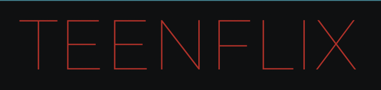
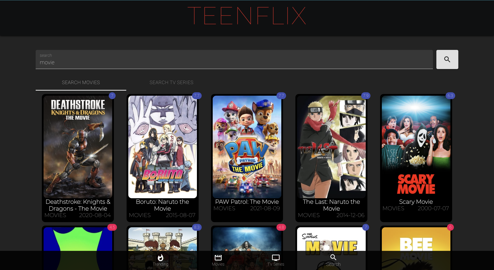
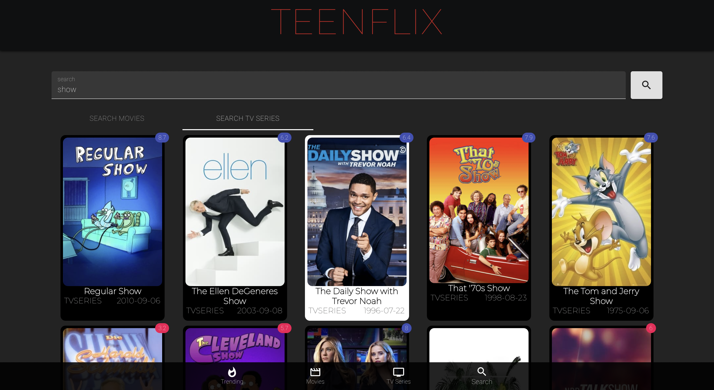
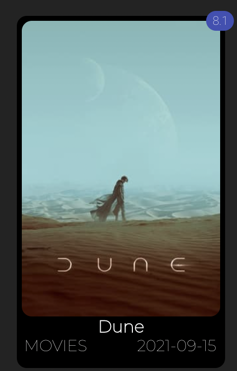
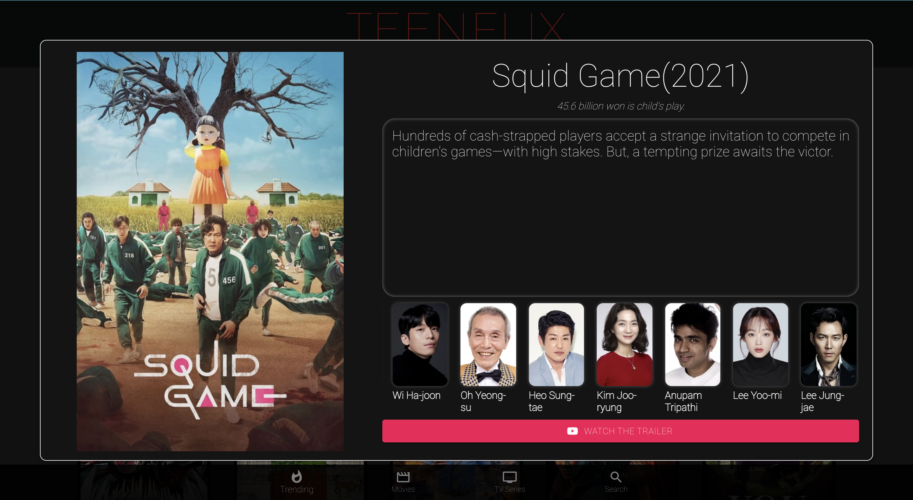

<p align="center">
  <a href="" rel="noopener">
 </a>
</p>

<h3 align="center"> <a href = "https://teenflix.netlify.app/">TeenFlix App </a></h3>

<!-- <div align="center">

  []() 
  [](https://github.com/kylelobo/The-Documentation-Compendium/issues)
  [](https://github.com/kylelobo/The-Documentation-Compendium/pulls)
  [](/LICENSE)

</div> -->

> <p align="center"> An application to display trending movies, TV shows, and other information such as rating, description, poster, cast, etc.</p>


<!-- <p align="center">
  <a href="" rel="noopener">
 </a>
</p> -->


## Table of Contents
- [Table of Contents](#table-of-contents)
- [About <a name = "about"></a>](#about-)
- [Getting Started <a name = "getting_started"></a>](#getting-started-)
  - [Prerequisites](#prerequisites)
  - [Installing](#installing)
  - [Running the tests <a name = "tests"></a>](#running-the-tests-)
- [Usage <a name="usage"></a>](#usage-)
  - [Pages](#pages)
  - [Components](#components)
  - [Hooks](#hooks)
- [Deployment <a name = "deployment"></a>](#deployment-)
- [Built Using <a name = "built_using"></a>](#built-using-)
- [Authors <a name = "authors"></a>](#️-authors-)

## About <a name = "about"></a>
TeenFlix is a `React-based` application that displays the top **200** trending movies and TV shows along with their `rating`, `type`, `poster`, `release date`, `trailer'` and `title`. 

The short video below shows how the application works.


Users can also `search` for movies and TV shows separately with options to filter them `by multiple genres` such as `Action`, `Adventure`, `Animation`, `Comedy`, `Crime`, `Documentary`, `Drama`, `Fantasy`, `Family`, `History`, `Horror`, `Music`, `Mystery`, `Romance`, `Science Fiction`, `TV movie`, `Thriller`, `War` and `Western`. Multiple filters can be applied to refine the searches. 


Users can also `search` for movies and TV shows `by title`, and view all results that match the given `keyword`.




Clicking on each title would show users the `movie poster`, `title`, `description`, `movie cast`, `tagline` and a button to view the `movie trailer` as well.

<p align="center">
<a href="" rel="noopener">
 </a>
  <a href="" rel="noopener">
 </a>
 
</p>

## Getting Started <a name = "getting_started"></a>

A live version of the application is deployed on Netlify [here](https://teenflix.netlify.app/).

To download it on your local machine, follow the steps below.

```bash
$ git clone https://github.com/Rajeet10/Teenflix.git
$ cd TeenFlix
```

### Prerequisites

It is important to have `node` and `npm` installed on your system for running the application locally.

You also need an API key for your application from the [MovieDB API](https://developers.themoviedb.org/3/getting-started/introduction). This API Key would be assigned to the REACT_APP_API_KEY in the environmental variables in the `.env` file.

### Installing

To install the required packages, navigate to the project directory and run the following in the shell:

```bash
$ npm install
```

To begin the server, run the following in the shell:

```bash
$ npm start
```

The server will run at http://localhost:3000/

### Running the tests <a name = "tests"></a>

To run tests, navigate to the project directory and run the following in the shell:

```bash
$ npm test
```

## Usage <a name="usage"></a>

To view the `top trending movies and TV shows` in order of `popularity` navigate to the `home page` of the application or the `trending tab`.

To view `movies` individually, navigate to the `movies tab` and apply `filters` by clicking on the buttons. All `selected filters` are applied together.

To view `TV shows` individually, navigate to the `TV Series tab` and apply `filters` by clicking on the buttons. All `selected filters` are applied together.

To search for movies or TV shows, navigate to the `Search tab` and enter your query in the search bar.

All the content is paginated, and subsequent pages can be viewed by scrolling to the bottom of the page and selecting the next page.

### Pages 

The application contains four pages for `Movies`, `Series`, `Trending` and `Search` present within their respective directories in `./src/Pages`.

### Components

The application contains many components such as the `Carousel`, `ContentModal`, `Genres`, `Header`, `Pagination`, `Single Content` and `Main Navbar` which can all be found in their respective directories in `./src/Components`.

### Hooks

The application contains the `useGenre` hook present in `./src/hooks`.


## Deployment <a name = "deployment"></a>

This application has also been deployed on [Netlify](https://netlify.com/) over [here](https://teenflix.netlify.app/).

In order to deploy this application using Netlify, follow the steps below:

```bash
$ cd Teenflix
$ npm run build
$ npm install netlify-cli -g
$ netlify deploy
```

Answer the questions in the shell, and the app is ready!

You can find more information [here](https://www.netlify.com/blog/2016/07/22/deploy-react-apps-in-less-than-30-seconds/) and [here](https://www.freecodecamp.org/news/how-to-deploy-react-router-based-app-to-netlify/).

## Built Using <a name = "built_using"></a>

- React
- JavaScript
- HTML
- CSS

The application also makes use of the [MovieDB API](https://api.themoviedb.org/3/trending/all/day?api_key=${process.env.REACT_APP_API_KEY}&page=${page}). You can find more information about the API [here](https://www.themoviedb.org/documentation/api).

## Authors <a name = "authors"></a>
- [@Rajeet10](https://github.com/Rajeet10)


<!-- # Getting Started with Create React App

This project was bootstrapped with [Create React App](https://github.com/facebook/create-react-app).

## Available Scripts

In the project directory, you can run:

### `npm start`

Runs the app in the development mode.\
Open [http://localhost:3000](http://localhost:3000) to view it in the browser.

The page will reload if you make edits.\
You will also see any lint errors in the console.

### `npm test`

Launches the test runner in the interactive watch mode.\
See the section about [running tests](https://facebook.github.io/create-react-app/docs/running-tests) for more information.

### `npm run build`

Builds the app for production to the `build` folder.\
It correctly bundles React in production mode and optimizes the build for the best performance.

The build is minified and the filenames include the hashes.\
Your app is ready to be deployed!

See the section about [deployment](https://facebook.github.io/create-react-app/docs/deployment) for more information.

### `npm run eject`

**Note: this is a one-way operation. Once you `eject`, you can’t go back!**

If you aren’t satisfied with the build tool and configuration choices, you can `eject` at any time. This command will remove the single build dependency from your project.

Instead, it will copy all the configuration files and the transitive dependencies (webpack, Babel, ESLint, etc) right into your project so you have full control over them. All of the commands except `eject` will still work, but they will point to the copied scripts so you can tweak them. At this point you’re on your own.

You don’t have to ever use `eject`. The curated feature set is suitable for small and middle deployments, and you shouldn’t feel obligated to use this feature. However we understand that this tool wouldn’t be useful if you couldn’t customize it when you are ready for it.

## Learn More

You can learn more in the [Create React App documentation](https://facebook.github.io/create-react-app/docs/getting-started).

To learn React, check out the [React documentation](https://reactjs.org/).

### Code Splitting

This section has moved here: [https://facebook.github.io/create-react-app/docs/code-splitting](https://facebook.github.io/create-react-app/docs/code-splitting)

### Analyzing the Bundle Size

This section has moved here: [https://facebook.github.io/create-react-app/docs/analyzing-the-bundle-size](https://facebook.github.io/create-react-app/docs/analyzing-the-bundle-size)

### Making a Progressive Web App

This section has moved here: [https://facebook.github.io/create-react-app/docs/making-a-progressive-web-app](https://facebook.github.io/create-react-app/docs/making-a-progressive-web-app)

### Advanced Configuration

This section has moved here: [https://facebook.github.io/create-react-app/docs/advanced-configuration](https://facebook.github.io/create-react-app/docs/advanced-configuration)

### Deployment

This section has moved here: [https://facebook.github.io/create-react-app/docs/deployment](https://facebook.github.io/create-react-app/docs/deployment)

### `npm run build` fails to minify

This section has moved here: [https://facebook.github.io/create-react-app/docs/troubleshooting#npm-run-build-fails-to-minify](https://facebook.github.io/create-react-app/docs/troubleshooting#npm-run-build-fails-to-minify) -->
